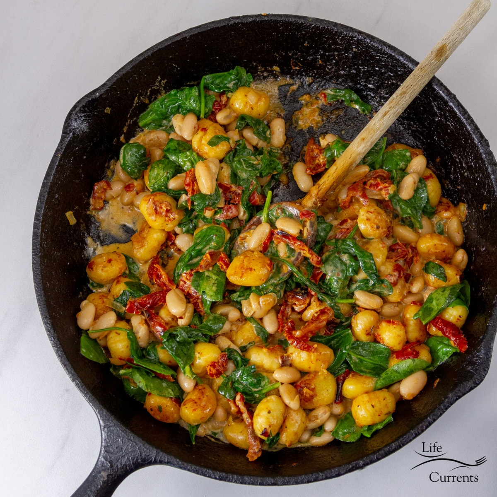

# White Bean Sun-Dried Tomato Gnocchi

**Source:** https://lifecurrentsblog.com/white-bean-sun-dried-tomato-gnocchi/?utm_source=Pinterest&utm_medium=organic
**Author:** Debi
**Yield:** ['4', '4 servings']
**Prep time:** PT10M
**Cook time:** PT15M
**Total time:** PT25M
**Category:** ['Main Course']
**Cuisine:** ['American']
**Rating:** 5 (27 ratings/reviews)

White Bean Sun-Dried Tomato Gnocchi is an easy one pan healthy dinner that’s ready in less than 30 minutes. And it come together using classic hearty ingredients that you probably have in your kitchen right now.

## Ingredients

- ½ cup sliced oil-packed sun-dried tomatoes (plus 1 tablespoon oil from the jar, divided use)
- 1 large shallot (minced)
- ⅓ cup low-sodium vegetable broth
- 12 ounces gnocchi
- 15 ounce low-sodium cannellini beans (drained and rinsed)
- 5 ounces baby spinach
- ⅓ cup heavy cream
- ¼ teaspoon salt
- ¼ teaspoon ground pepper
- 2 tablespoons fresh basil leaves (chopped)

## Preparation

1. Heat 1 tablespoon oil from the oil packed sun-dried tomatoes in a large nonstick skillet over medium-high heat. Add sun-dried tomatoes and chopped shallot; cook, stirring, for 1 minute. Add broth, and cook until the liquid has mostly evaporated, about 2 minutes.
2. Add gnocchi and cook, stirring often, until starting to brown, about 5 minutes. Add beans and spinach and cook until the spinach is wilted, about 1 minute.
3. Reduce heat to medium-low and stir in cream, salt, and pepper. Stir to coat with the sauce. Serve topped with chopped basil.

## Nutrition supplied by source

- **Calories:** 370 kcal
- **Carbohydrate :** 59 g
- **Protein :** 14 g
- **Fat :** 10 g
- **Saturated Fat :** 5 g
- **Cholesterol :** 22 mg
- **Sodium :** 590 mg
- **Fiber :** 9 g
- **Sugar :** 2 g
- **Unsaturated Fat :** 4 g
- **Serving Size:** 1 serving

## Tags

['Main Course']; ['American']; gnocchi; spinach; sun dried tomatoes; white bean
